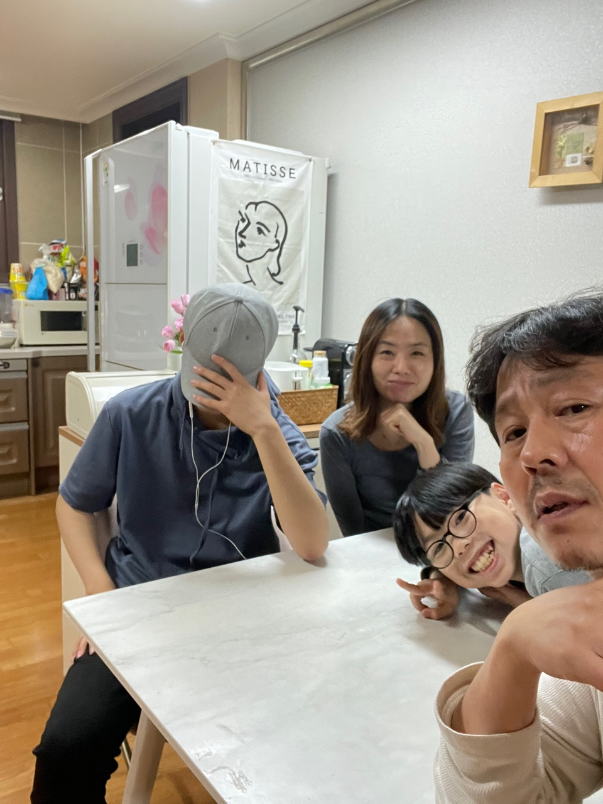

# (2022)서울하드웨어해커톤
---
1. [팀명 및 팀원](#팀명-및-팀원)
2. [프로젝트 제목](#프로젝트-제목) 
3. [프로젝트 배경 및 목적](#프로젝트-배경-및-목적)
4. [파일리스트](#파일리스트)
5. [코드 기여자](#코드-기여자)
6. [보드](#보드)
7. [구현 사항](#구현)
8. [개발시 문제점/애로사항 및 해결방법](#개발시_문제점_애로사항_및_해결방법)

[별첨](#별첨)

---

## 팀명 및 팀원
- 팀명: WNB
- 팀원 
   
이름|역할
---|---
황해연|기획/설계/개발(하드웨어/소프트웨어)
김민전|개발(소프트웨어)
황인규|기획/테스트
황인후|테스트

---

## 프로젝트 제목

**카메라기반 화재감지 시스템 (Fire detection camera w/ Context Awareness)**

---

## 프로젝트 배경 및 목적 
#### 배경
- 코로나 이후 재택 및 가정내 생활이 증가함에 따라
- 취사 및 겨울철 난방기 사용증가로 가정내 화재 위험 증가.

#### 하고자 하는것
- 가정내 화재감지를 위한 대안으로 고비용의 열화상카메라 또는 열감지 센서 대신,
- 저가의 보급형카메라와 인공지능 기술을 이용하여 불꽃 및 화재를 감지하는
- 가정내 초간단 시스템 개발 및 보급 필요성 대두
- **카메라 기반 화재감지 시스템**

---

## 파일리스트
  
#### 아두이노 우노 [[github]](https://github.com/pushdown99/fire-finder/tree/main/src/arduino%20uno%20(step-motor))
~~~console
├─step-motor.ino
~~~

- 소스파일(*.ino) / Arduino IDE 1.8.19

파일명|내용
---|---
step-motor.ino|스템모터제어 / I2C LiquidCrystal LCD 16x2 디스플레이 / controller(B-L4S5I)와 시리얼통신 

#### ESP32-CAM 보드 [[github]](https://github.com/pushdown99/fire-finder/tree/main/src/esp32-cam%20(camera-streamer))

~~~console
├─esp32-cam-streamer.ino 
├─app_httpd.cpp 
├─camera_index.h 
├─camera_pins.h 
~~~

- 소스파일(*.ino, *.cpp) / Arduino IDE 1.8.19, ESP32 (1.0.2rc)

파일명|내용
---|---
esp32-cam-streamer.ino|ESP32-CAM pre-define 및 환경설정, 접속 시 LED 제어 (Wi-Fi 및 서비스 완료여부를 가시적으로 확인)  
app_httpd.cpp|웹서비스 handler 정의 및 callback

- 소스파일(*.h)
  
파일명|내용
---|---
camera_index.h|index페이지에 대한 압축(gzip) 데이터
camera_pins.h|ESP32 제품군 핀 정의 선언파일  

#### B-L4S5I [[github]](https://github.com/pushdown99/fire-finder/tree/main/src/b-l475E%20(controller))

~~~console
├─main.cpp 
├─mcp3008 (lib/external) 
~~~

- 소스파일(*.cpp) / MBED OS 6

파일명|내용
---|---
main.cpp|ADC(mcp3008) / MAX4466(Analog MIC제어), Serial 통신 (w/Step-motor), FFT (Fast Fourier Transform; CDFT)  

- 소스파일(*.h)
  
파일명|내용
---|---
camera_index.h|index페이지에 대한 압축(gzip) 데이터
camera_pins.h|ESP32 제품군 핀 정의 선언파일  

---

## 코드 기여자 

#### 아두이노 우노

파일명|기여자
---|---
step-motor.ino|황해연 

#### ESP32-CAM 보드

파일명|기여자
---|---
esp32-cam-streamer.ino|황해연 

#### B-L4S5I

파일명|기여자
---|---
main.cpp|황해연 

---

## 보드 

구현보드|목적|소스위치
:---|:---|:---
B-L4S5I|제어장치 - 마이크앰프처리 - 음향감지 - 시리얼통신|[https://github.com/pushdown99/fire-finder/tree/main/src/b-l475E%20(controller)](https://github.com/pushdown99/fire-finder/tree/main/src/b-l475E%20(controller))  
Arduino Uno|제어장치 - 스텝모터제어 - LCD 16x2 - 시리얼통신|[https://github.com/pushdown99/fire-finder/tree/main/src/arduino%20uno%20(step-motor)](https://github.com/pushdown99/fire-finder/tree/main/src/arduino%20uno%20(step-motor))  
ESP32-CAM|카메라 및 스트리머(캡쳐장치)|[https://github.com/pushdown99/fire-finder/tree/main/src/esp32-cam%20(camera-streamer)](https://github.com/pushdown99/fire-finder/tree/main/src/esp32-cam%20(camera-streamer))  

---

## 구현 사항

#### Peripheral
종류|디바이스|목적|소스위치
:---|:---|:---|:---
SPI|MAX4466/MCP3008|마이크앰프 복수채널 I/O|main.cpp https://github.com/pushdown99/fire-finder/blob/main/src/b-l475E%20(controller)/main.cpp
I2C|LiquidCrystal 16x2|상태표시|step-motor.ino|https://github.com/pushdown99/fire-finder/blob/main/src/arduino%20uno%20(step-motor)/step-motor.ino

---

## 개발시 문제점/애로사항 및 해결방법

#### 문제점/애로사항

문제점/애로사항|설명|해결방법
:---|:---|:---
다수의 보드사용|재료구성 및 시나리오 설정 오류|스텝모터 전원 및 스펙(오버스펙)/카메라인터페이스 예제 미확인/카메라보드(언더스펙) 등
MBED OS 빌드|타겟보드로서 B-L4S5I 샘플지원 미비|타겟보드와 유사한 475VG로 빌드하거나, mbed-os-example 에서 구현
B-L4S5I analog pin gain값이 상이함|analog pin에서의 MIC audio gain 값이 pin 별로 상이함|calibration / 멀티채널 ADC 채택(mcp3008)
스텝모터선정오류|동작조건(12V, 3A), 공통전원 5V|외부어뎁터 승압/부스터 제작 및 B-L4S5I pinout 3.3V이므로 Uno에서 제어(대신 통신은 시리얼) 
MAX4466 Gain값 상이|중국 저가부품 사용에 따른 차이점|FFT를 이용한 주파수해석 및 이를 통한 음향분석

#### 앞으로 해결할 미션

- 저가 옴니마이를 활용한 고성능 지향성마이크 구현 (차음/흡음재 활용, 음성분석을 통한 마이크어레이 효과 구현)
- 사용보드 및 자재의 최적화 및 일원화
- 객체 및 맥락인식을 위한 엣지컴퓨팅에 인공지능 기능 탑재
- 클라우드 연동을 통한 활용도 증가

